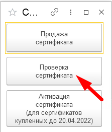

# Работа с сертификатами
# Продажа сертификатов

Чтобы продать сертификат, необходимо:

1. Авторизовать клиента

1. Перейти в **“Программа лояльности” > “Сертификат” > “Продажа сертификата”**

1. Введите код подтверждения и нажмите на **“Авторизовать”.** При авторизации по QR-коду карты, авторизация через смс не требуется.

1. Введите номинал сертификата (от 200₽ до 5 000₽ с кратностью 100₽), соблюдающие условия продажи сертификата, и нажмите на кнопку **“Применить”**

1. Выберите форму оплаты 

1. Подтвердите оплату 

**-наличные**

**-платежная карта**

После продажи сертификата, клиенту на телефон(который вы авторизовали) придет смс с ссылкой на сертификат, номиналом и сроком действия.

#
# **Активация сертификата!!!**
## **I.Для сертификатов купленных до 20.04.2022 включительно.**
Чтобы активировать сертификат необходимо:

1. Авторизовать клиента

1. Перейти в **“Программа лояльности” > “Сертификат” > “Активация сертификата” (для сертификатов купленных до 25.04.2022)**

1. Введите код подтверждения и нажмите на **“Авторизовать”**

1. Введите номер подарочного сертификата и нажмите на “Применить”

1. Отобразиться форма, в которой прописан статус сертификата,  номер сертификата, номинал, и дата сгорания. Для того, чтобы активировать сертификат, нажмите на кнопку **“Активировать”**

После активации будет выведено сообщение что сертификат успешно активирован. Далее можно проводить продажу. Более подробная инструкция по старым сертификат по ссылке ниже.

<https://disk.yandex.ru/i/WYDxQrc_dS8Tzg>
## **II. Для сертификатов, купленных с 21.04.2022 включительно.**
**Важно!** Сертификатами можно оплачивать только в той информационной базе 1С, в которой он был куплен.

Чтобы активировать сертификат необходимо:

1. Авторизовать клиента

1. Добавить в чек необходимые товары
1. Нажимаем на платежную карту
1. Закройте окно оплаты банковской картой

1. Нажмите на **“Серт.”** 

Отсканируйте сертификат со сканера, либо введите его номер вручную и нажмите **“Enter”** на клавиатуре

У вас отобразится **сертификат, номер сертификата, номинал, и его остаток.** 

Для **применения** сертификата нажмите на сертификат на желтую кнопку

1. **При полной оплате покупки** сертификатом, у вас отобразится сумма по сертификату. Для подтверждения оплаты нажмите на “Enter”

После подтверждение оплаты, выйдет окно с предложением продолжить подбор товаров, или проведение оплаты

Нажмите на “Нет” для проведение оплаты

Нажмите на “Да” для продолжения подбора товаров

**При частичной оплате покупки** сертификатом, вам необходимо будет выбрать форму оплаты для закрытии чека. 

Для того, чтобы оплатить остаток покупки, нажмите на **“Нал.”** для оплаты наличными, или на **“ПК”**, для оплаты пластиковой картой.

После того, как клиент оплатил остаток покупки, нажмите на **“Enter”** чтобы провести чек 

# **Проверка сертификата**
Чтобы проверить сертификат необходимо:

1. Авторизовать клиента

1. Нажать на “Проверка сертификата”

1. Ввести номер подарочного сертификата и нажать на “Enter” на клавиатуре, либо его сканировать.

У вас отобразиться полная информация о сертификате

# **Возврат сертификата**
Для возврата сертификата необходимо:

1. Нажать на **“Возврат”**, выбрать чек с возвратом, и нажать на желтую кнопку или **“Enter”** на клавиатуре

Выбираем “Возврат от покупателя” и жмем на желтую кнопку или “Enter” на клавиатуре

1. Выбираем форму оплаты которая проводилась при оплате сертификата 

-**наличные**

Нажмите на **“Наличные”**, и нажмите на **“Enter”**

-**платежная карта**

Нажмите на **“Плат. карта”**, проведите операцию по карте, и нажмите на **“Enter”**

# Возврат товара, оплаченный сертификатом
Для возврата товара, оплаченный сертификатом, необходимо:

1. Нажать на **“Возврат”**, выбрать чек с возвратом, и нажать на желтую кнопку или **“Enter”** на клавиатуре

Выбираем **“Возврат от покупателя”** и жмем на желтую кнопку или **“Enter”** на клавиатуре

1. Выберите форму оплаты **“Наличные”** и нажмите на **“Enter”.** Выдайте деньги клиенту из кассы.

