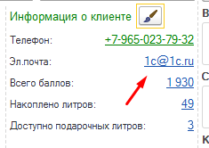
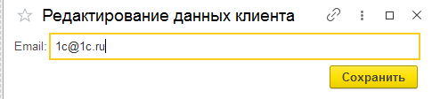
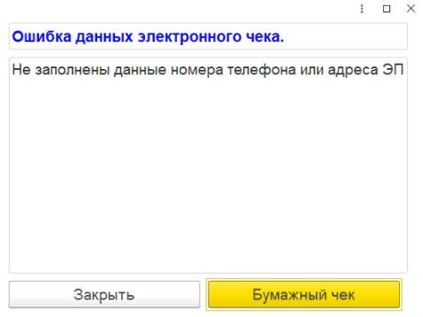

# Пробитие фискального чека без печати

**Важно:**

1. **Для возможности отправки фискальных чеков в электронном виде, вам нужно включить эту функцию в настройках каждой кассы в 1С. (см. [инструкцию “Включение пробития чека без печати](https://docs.google.com/document/d/17iFkq0j0P30FcmwU5992sLSVKJKibJL_v48XxWP4bfI/edit)”)**
1. **Чеки, выходящие после оплаты безнал - регулирует банк, который у вас установил эквайринг. Необходимо обратиться в техническую поддержку банка.**

**\*в Сбербанке обязательно необходимо печать слип чек об оплате.**

1. **Отправка фискального чека на номер телефона сработает ТОЛЬКО с подключенным тарифным планом, в составе которого есть отправка СМС (услуга платная). Например: [Такском ОФД**](https://taxcom.ru/upload/documents/doc_ofd/taxcom-ofd.tariffs.pdf)**

**Доработка для автоматической подстановки e-mail клиента для отправки чека электронным письмом:**

1.Если почта заполнена у клиента,то переходим в **п.2**. Если не заполнена, то переходим в **п.1.1**

1.1. Если почта не заполнена, то чтобы заполнить эл. почту в **“Информации о клиенте”**, жмем на **“Не заполнено”**, **авторизуем** клиента по QR-коду карты или коду из СМС, и вводим эл. почту в строке **email**. После ввода почты, жмем на желтую кнопку “**Сохранить**”

\2. Жмем на кнопку оплаты (“**Наличные”** или “**Плат.Карта”**), и почта клиента подставиться для отправки электронного чека.

Инструкция при оплате “НАЛИЧНЫМИ”:

1. Чтобы отправить фискальный чек по e-mail или смс, после нажатия на кнопку оплаты у вас отобразится окно оплаты ниже

1. В левом нижнем углу укажите тот способ отправки фискального чека, который необходим, введите данные, и подтвердите введенные данные. Можно выбрать только 1 способ отправки электронного чека (либо по email, либо по номеру телефона).

2.1. Email - услуга по отправке чека через email предоставляется ОФД бесплатно.

Заполняем email и нажимаем желтую кнопку.

2.2. По номеру телефона - заполняем номер телефона и нажимаем на желтую кнопку “Enter”

Важно! Данный способ отправки зависит от тарифа ОФД, который подключен к вашей кассе. СМС будет отправлена **ТОЛЬКО** если у вас подключен тарифный план, в составе которого есть отправка СМС.

Даже если вы попытаетесь ввести номер телефона и провести оплату, ОФД не отправит этот чек на номер телефона без подключенного тарифа плана, в составе которого есть отправка СМС.

1. После подтверждения способа отправки чека, нажмите на желтую кнопку “Enter”, чтобы произвести оплату и отправку электронного чека.

В случае, если вы не заполните email или номер телефона для отправки электронного чека, то 1С вам напомнит перед подтверждением оплаты, а также предложит напечатать бумажный чек на кассе, если вы, например, не хотите отправлять их в электронном виде.

Инструкция при оплате “ПО ПЛАТЕЖНОЙ КАРТЕ”:

1. Чтобы отправить фискальный чек по e-mail или смс, после нажатия на кнопку оплаты у вас отобразится окно оплаты ниже

1. В правом нижнем углу укажите тот способ отправки фискального чека, который необходим, введите данные, и подтвердите введенные данные. Можно выбрать только 1 способ отправки электронного чека (либо по email, либо по номеру телефона).

2.1. Email - услуга по отправке чека через email предоставляется ОФД бесплатно.

Заполняем email и нажимаем желтую кнопку.

2.2. По номеру телефона - заполняем номер телефона и нажимаем на желтую кнопку “Enter”

Важно! Данный способ отправки зависит от тарифа ОФД, который подключен к вашей кассе. СМС будет отправлена **ТОЛЬКО** если у вас подключен тарифный план, в составе которого есть отправка СМС.

Даже если вы попытаетесь ввести номер телефона и провести оплату, ОФД не отправит этот чек на номер телефона без подключенного тарифа плана, в составе которого есть отправка СМС.

1. После подтверждения способа отправки фискального чека, нажмите на желтую кнопку “Enter”, чтобы произвести оплату и отправку электронного чека.

В случае, если вы не заполните email или номер телефона для отправки электронного чека, то 1С вам напомнит перед подтверждением оплаты, а также предложит напечатать бумажный чек на кассе, если вы, например, не хотите отправлять их в электронном виде.

